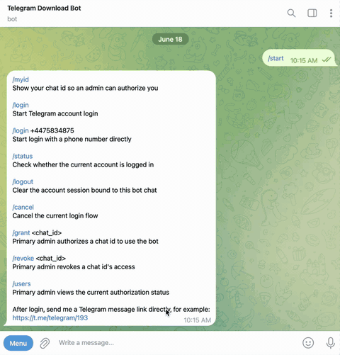

# telegram-download-bot

English | [中文说明](README.zh.md)

telegram-download-bot is a Telegram MTProto download-and-send-back bot built on top of [tdl](https://github.com/iyear/tdl). Send a Telegram message link to the bot, and it will download the original message content with a logged-in Telegram user account, then send text, photos, videos, documents, or albums back through the bot.



## Features

- Receive Telegram message links through a Telegram Bot
- Download message content with a logged-in MTProto user account
- Send text, photos, videos, documents, and albums back through the bot
- Login to a Telegram user account inside the bot flow
- Admin-only authorization management
- Fixed bot language from config, currently English and Chinese

## Configuration

Copy the example config first:

```bash
cp config.example.yaml config.yaml
```

Then edit `config.yaml`:

```yaml
bot:
  token: "YOUR_TELEGRAM_BOT_TOKEN"
  debug: false
  language: "en"

telegram:
  app-id: 123456
  app-hash: "YOUR_TELEGRAM_APP_HASH"

auth:
  admin-chat-id: 123456789
  allowed-chat-ids: []

tdl:
  proxy: ""
  ntp: ""
  reconnect-timeout: "5m"
  threads: 4
  limit: 2
  pool: 8
  delay: "0s"
```

Important fields:

- `bot.token`: Bot token from BotFather
- `bot.language`: required bot language, only `en` and `zh` are supported
- `telegram.app-id` and `telegram.app-hash`: Telegram API credentials
- `auth.admin-chat-id`: the primary admin chat id
- `auth.allowed-chat-ids`: regular users allowed to use the bot
- `tdl.proxy`: optional proxy, for example `socks5://127.0.0.1:7890`

How to get `telegram.app-id` and `telegram.app-hash`:

1. Open [my.telegram.org](https://my.telegram.org/) and log in with your Telegram phone number.
2. Go to **API development tools**.
3. Create an application if you do not already have one.
4. Copy the displayed `api_id` into `telegram.app-id` and `api_hash` into `telegram.app-hash`.

The language is global and fixed by config. Users cannot choose or switch language in chat. If `bot.language` is `en`, all bot prompts use English; if it is `zh`, all bot prompts use Chinese.

## Docker Compose Deployment

Download `docker-compose.yml` and `config.example.yaml` from this repository, then place them in the same deployment directory.

Copy `config.example.yaml` to `config.yaml`, then edit `config.yaml` with your bot token, Telegram API credentials, and admin chat id.

Start the bot:

```bash
docker compose up -d
```

## Bot Commands

- `/start`: show help
- `/help`: show help
- `/myid`: show current chat id
- `/login`: start Telegram account login
- `/login +4475834875`: start login with a phone number
- `/status`: check login status
- `/logout`: clear the current account session
- `/cancel`: cancel the current login flow
- `/grant <chat_id>`: primary admin authorizes a user
- `/revoke <chat_id>`: primary admin revokes a user
- `/users`: primary admin views authorization status

After login, send a Telegram message link directly to download and send it back.

## Contact 💬

- 🤖 Bot: [@ConnectingEveryCornerBot](https://t.me/ConnectingEveryCornerBot)
- 👤 Telegram: [@ConnectingEveryCorner](https://t.me/ConnectingEveryCorner)
- 📢 Channel: [CECBoard](https://t.me/CECBoard)

## License

This project is licensed under AGPL-3.0. The full AGPL-3.0 license text is archived at `licenses/LICENSE.upstream-AGPL-3.0.txt`. Read the current `LICENSE` file for project license notes.
